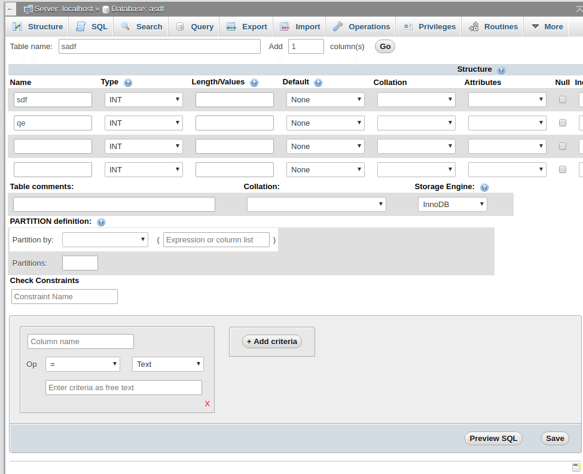
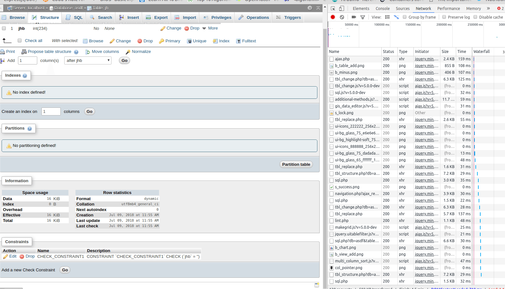

### [Add Support for CHECK Constraints](https://github.com/phpmyadmin/phpmyadmin/issues/13592)
#### Post 1
This feature request is divided in three parts - 
1. Implement an interface for interacting with these constraints
2. Update parser to understand this syntax
3. Update the export interface to allow including these in an export

Mysql does not provide any way to alter the definition of a constraint. The main idea is to add support for a constraint and additionally build a feature seperate from mysql to alter a constraint.

I'm currenlty working on the interface to build, edit and drop check constraints.(The first part)
Work done - 
1. Implemented UI to add a check constraint during table creation.

2. Implemented UI to show defined constraints on a table in table structure.

### Plans for this week-
1. Finish the functionality to add/drop/alter constraints(first part).
2. Update parser to understand syntax(second part).